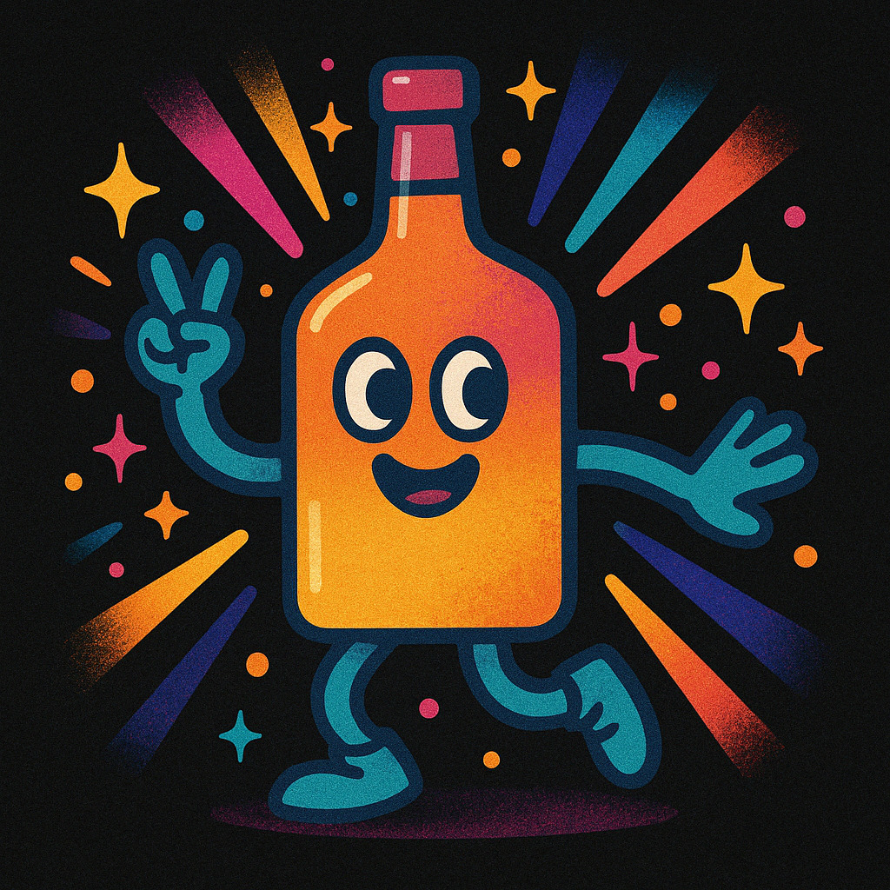

# 📱 GanaGoza - Interactive Challenge Game

<div align="center">
  
  <p><i>Create challenges, spin the bottle, and have fun!</i></p>
</div>

## 🎮 About The App

GanaGoza is an interactive challenge-based game where users can create custom challenges, spin a virtual bottle, and whoever gets pointed at must complete the challenge. Perfect for parties, gatherings, or any social event!

### Key Features

- **Custom Challenges**: Create, edit, and delete your own challenges
- **Interactive Spinning Bottle**: Realistic bottle spinning animation with Lottie
- **Multilingual Support**: Available in Spanish (default), English, French, and Portuguese
- **Game Controls**: Toggle sound effects, share the app with friends
- **Clean Interface**: User-friendly UI with light/dark theme support
- **Game Rules & Privacy**: Includes game rules, privacy policy, and terms of service

## 🛠️ Tech Stack

<div align="center" style="display: flex; flex-wrap: wrap; gap: 8px;">
  
  
  
  
  
  
</div>

## 📂 Project Structure

```
com.dapm.ganagoza/
├── adaptador/
│   └── AdaptadorDeRetos.kt              # Adapter for challenges display
├── datos/
│   ├── base_datos/
│   │   └── BaseDatosReto.kt             # Room database configuration
│   └── dao/
│       └── AccesoDatosReto.kt           # Data Access Object for challenges
├── interfaz/
│   ├── actividad/
│   │   └── MainActivity.kt              # Main application activity
│   ├── dialogo/
│   │   ├── DialogoAgregarReto.kt        # Dialog for adding challenges
│   │   ├── DialogoEditarReto.kt         # Dialog for editing challenges
│   │   ├── DialogoEliminarReto.kt       # Dialog for deleting challenges
│   │   ├── DialogoIdioma.kt             # Dialog for language selection
│   │   ├── DialogoMostrarReto.kt        # Dialog for displaying challenges
│   │   └── DialogoPrivacidadCondiciones.kt # Privacy & terms dialog
│   ├── fragmento/
│   │   └── FragmentoJuego.kt            # Main game fragment
│   └── vista/
│       ├── AgregarReto.kt               # Add challenge view
│       ├── PantallaPresentacion.kt      # Splash screen
│       ├── ReglaJuego.kt                # Game rules view
│       └── vistaholder/
│           └── ContenedorVistaReto.kt   # ViewHolder for challenges
├── modelo/
│   └── Reto.kt                          # Challenge data model
├── repositorio/
│   └── RepositorioRetos.kt              # Repository pattern implementation
├── utilidades/
│   ├── publicidad/
│   │   ├── ConfiguracionAnuncios.kt     # AdMob configuration
│   │   └── GestorPublicidad.kt          # AdMob manager
│   ├── Constantes.kt                    # App constants
│   └── GestorIdioma.kt                  # Language manager
└── vistamodelo/
    └── VistaModeloJuego.kt              # MVVM ViewModel
```

## 🚀 Getting Started

### Prerequisites

- Android Studio Arctic Fox or newer
- JDK 17
- Android SDK level 34
- Gradle 8.10
- Android Gradle Plugin 8.3.0

### Installation

1. Clone the repository
```bash
git clone https://github.com/yourusername/ganagoza.git
cd ganagoza
```

2. Open the project in Android Studio

3. Sync Gradle files and build the project

4. Run on an emulator or physical device with minSdk 24 (Android 7.0) or higher

## 📚 Required Dependencies

The app requires the following key dependencies:

- AndroidX Core KTX
- AndroidX AppCompat
- Material Components
- AndroidX Navigation (Fragment & UI)
- Lottie for animations
- AndroidX Lifecycle ViewModel
- Glide for image loading
- Room for local database
- Coroutines for asynchronous programming
- Floating Action Button
- Google Play Services Ads (AdMob)

## 🎯 How the Game Works

1. **Create Challenges**: Users can add, edit, and delete custom challenges
2. **Start the Game**: On the main game screen, users tap the "Spin" button
3. **Watch the Bottle**: The bottle spins with realistic animation
4. **Challenge Time**: After a 3-2-1 countdown, a random challenge appears
5. **Gameplay**: The person pointed at by the bottle must complete the challenge

## 📋 Game Menu

The game includes a menu with 5 main options:

- **🔊 Sound**: Toggle game sounds on/off
- **📜 Rules**: View game rules, privacy policy, and terms
- **🎯 Challenges**: Manage your custom challenges
- **📤 Share**: Share the app with friends
- **🌐 Language**: Change language (Spanish, English, French, Portuguese)

## 📱 App Screenshots

<div align="center">
  <div style="display: flex; flex-wrap: wrap; justify-content: center; gap: 10px;">
    
    
    
  </div>
  <p></p>
  <div style="display: flex; flex-wrap: wrap; justify-content: center; gap: 10px; margin-top: 10px;">
    
    
    
  </div>
  <p></p>
  <div style="display: flex; justify-content: center; margin-top: 10px;">
    
  </div>
</div>

## 📢 Advertising

The app integrates Google AdMob for monetization:
- Banner ads displayed in non-intrusive areas
- Interstitial ads shown at strategic moments

## ⚙️ Key Technical Features

- **MVVM Architecture**: Clean separation of concerns for better code organization
- **Room Database**: Local storage for user-created challenges
- **ProGuard Integration**: Code obfuscation and optimization in release builds
- **Resource Shrinking**: Optimized APK size in production
- **Multilingual Support**: Complete internationalization with multiple languages
- **Data Binding**: Efficient UI updates with less boilerplate code
- **ViewBinding**: Type-safe interaction with views

## 🌐 Multilingual Support

GanaGoza supports multiple languages:
- 🇪🇸 Spanish (Default)
- 🇺🇸 English
- 🇫🇷 French
- 🇵🇹 Portuguese

## 🎮 Game Features

### Challenge Management
Users can create an unlimited number of challenges to make each game unique and exciting. The app includes:
- Add new challenges with a simple interface
- Edit existing challenges to change their content
- Delete unwanted challenges
- View all created challenges in a scrollable list

### Interactive Gameplay
- A beautifully animated bottle that spins realistically
- Randomized selection of challenges for unpredictable fun
- Countdown timer to build suspense before revealing the challenge
- Clear display of the selected challenge

### User Experience
- Intuitive interface designed for players of all ages
- Quick access menu for essential game functions
- Ability to toggle sound effects on or off
- Easy sharing functionality to invite friends to play

## 👥 Contributors

- Erwin Del Aguila

## 📄 License

This project is licensed under the MIT License - see the [LICENSE](LICENSE) file for details.

---

Developed with ❤️ for fun and entertainment